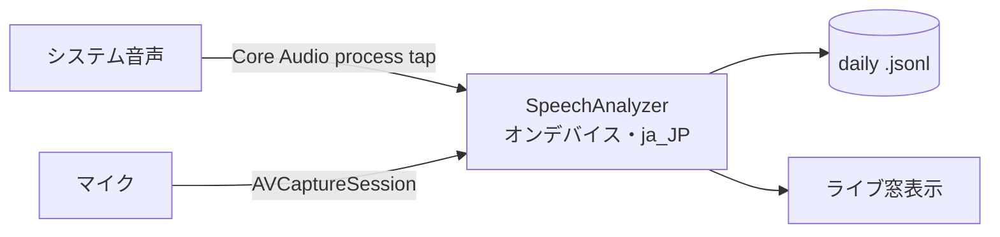

# steno

macOS 用の常時オンデバイス文字起こしツール。システム音声(通話相手)とマイク(自分)を同時に
聞き取り、会話をほぼリアルタイムで JSON Lines に書き続ける。

**音声は一切外に出ない。** 取得・認識・書き出しは全てローカル。ネットワークを使うのは Apple の
オンデバイス音声モデルの初回ダウンロードのみ。サーバもアカウントもテレメトリも無い。

## 仕組み



- **システム音声** — Core Audio process tap(ScreenCaptureKit ではない)。video pipeline も
  `replayd` も持たず、それ起因のハングや無音化が無い。
- **マイク** — 特定デバイスに固定した `AVCaptureSession`。システム既定の入力が切り替わっても
  (イヤホン接続など)選んだマイクで録り続ける。
- **話者の区別**は **source**(`system`=相手 / `mic`=自分)のみ。高精度で要約に十分なため、
  精度の低い話者分離モデルは持たない。

## 要件

- **macOS 26.0+**(`SpeechAnalyzer` と Core Audio process tap)
- **Apple Silicon**
- Swift 6 ツールチェイン(Xcode 26 / Command Line Tools)

## ビルドとインストール

```sh
make build     # → ./steno.app
make install   # → ~/Applications/steno.app
```

インストール後は `~/Applications` から起動する。初回に **マイク / 音声認識 / 音声キャプチャ** の
許可を求められる(いずれも「音声は外部送信しない」と明記)。

**署名**: Apple Development / Developer ID 証明書があればそれで、無ければ ad-hoc 署名になる。macOS
は許可(TCC)を署名単位で管理するため、ad-hoc だと再ビルドごとに許可がリセットされる。頻繁に
ビルドし直すなら自分の証明書で署名すると永続する。

## 使い方

- 窓にライブの文字起こし(時刻・`system`/`mic` バッジ・system は再生元アプリ名)。
- **マイク** ドロップダウンで入力デバイスを選択(記憶され、既定が変わっても固定)。
- **リセット** で再起動せずキャプチャを作り直す。

文字起こしは `~/.config/steno/transcripts/YYYY-MM-DD.jsonl` (ローカル日付)に追記される。

## 出力フォーマット

確定発話ごとに JSON 1 行。steno(書く)と後段(読む)の唯一の契約面:

```json
{"ts":"2026-06-16T15:28:06.186+09:00","epoch":1781591286.18,"isFinal":true,"seq":7,"source":"system","app":"Microsoft Teams","text":"…"}
```

| キー | 意味 |
|---|---|
| `ts` / `epoch` | ISO 8601 ローカル時刻 / Unix 秒 |
| `isFinal` | 常に `true`(確定発話のみ書く) |
| `seq` | ファイル内通し番号(日付替わり / 起動でリセット) |
| `source` | `system`(相手)/ `mic`(自分) |
| `app` | system のみ: 出力中だったアプリ名 |
| `text` | 文字起こしテキスト |

## 設定

環境変数(`Info.plist` の `LSEnvironment` で指定):

| 変数 | 意味 |
|---|---|
| `STENO_DIR` | 基準ディレクトリ(既定 `~/.config/steno`) |
| `TRANSCRIPT_DIR` | 出力先のみ(既定 `STENO_DIR/transcripts`) |
| `STENO_VOCAB` | 認識ヒント語彙ファイル |
| `STENO_DEBUG=1` | 詳細ログ |

**語彙ヒント**: 固有名詞・専門用語(1 行 1 語、`#` でコメント)を `~/.config/steno/vocabulary.txt`
に置くと認識ヒント(contextual strings)として渡され、一般モデルが崩す名前や用語が当たるように
なる。再起動で反映。

## ログ

`~/.config/steno/` に出力する:

- `steno.log` — 時刻付きの重要イベント(起動・復旧・エラー)。**まずここを見る**
- `stdout.log` / `stderr.log` — 生の標準出力 / 標準エラー(フレームワーク警告やクラッシュ直前の出力まで)。各 1 世代ローテート

## 既知の制限

- **確定までのレイテンシ**は長い発話で数十秒(瞬時ではない)。
- **`ja_JP` 専用**(ロケール固定)。他言語は `AppController.swift` のロケールを書き換える

## ライセンス

MIT — [LICENSE](LICENSE)。
